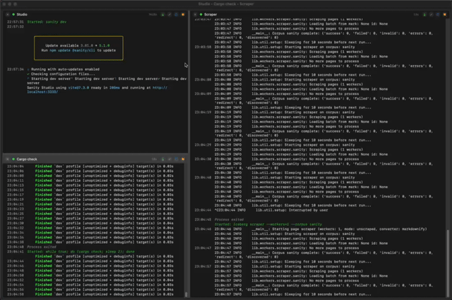

# Proceed

Proceed is a simple process manager for macOS:

* Start/stop/restart processes.
* Processes are controlled with tmux. They continue to run if you quit.
* Process output is shown in a nice paneled interface.
* Log output is stored in SQLite.
* Automatic loading of direnv.

# Dependencies

* macOS 15+
* tmux

# License

MIT License; see [LICENSE](LICENSE).
